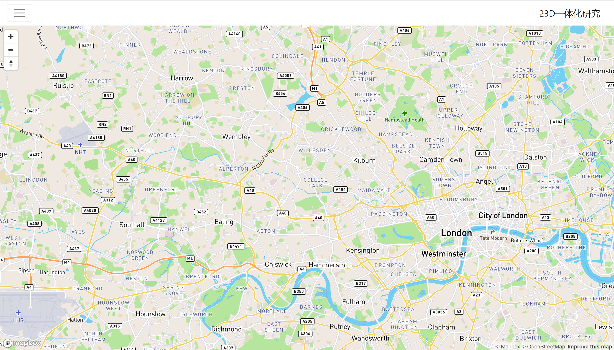
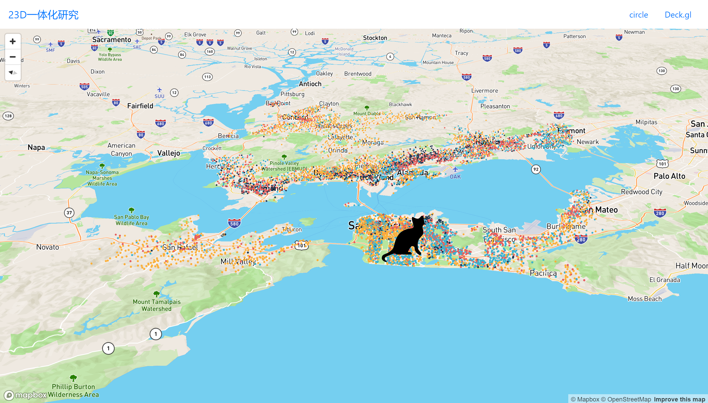
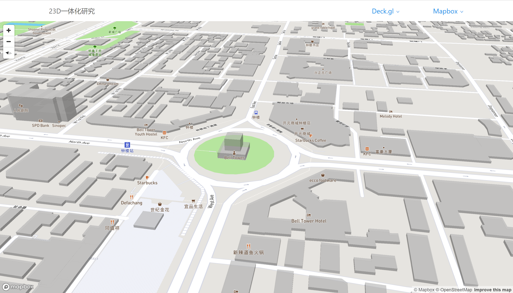

# 二三维一体化效果研究
> 基于React4、React-Bootstrap1.0及React-Mapbox-gl混合框架，使用Typescript语言（Javasript的超集）Webpack打包工具搭建的前端开发整合库，用来做基于Mapbox及deck.gl的效果研究。

### 基础环境
| 序号     | 名称     | 版本        |
| :------:  |:------: | :---------:|
|1          |Node      | ^v8|
|2          |Typesctipt| ^2.3       |           
|3          |Webpack   | ^2          |
|4          |React     | ^16          |
|5          |React-Bootstrap   | ^1.0          |
|6          |React-Mapbox-gl   | ^2.7          |
|7          |Deck.gl   | ^4.1.5       |
### 安装

1. clone项目
```shell
git clone https://github.com/guzhongren/23DProject.git
```
2. 安装依赖

    1. 在 ***项目跟目录*** 执行如下shell
        ``` shell
        npm install 
        #yarn install
        ```
    2. 全局安装webpack
        ```shell
        npm install -g webpack
        ```        
3. 运行项目
    ### 打包公共资源
    ```shell
    npm run vender
    ```
    ### 开发环境运行
    在项目跟目录运行如下命令
    ```shell
    npm run dev
    ```
    在浏览器中打开 http://localhost:8080 即可
    ### 生产环境运行
    ```shell
    npm run build
    ```
    在浏览器中打开wwwroot下的index.html页面即可
    ### 效果
    
### 效果

<center>添加圆及图片</center>


<center>西安钟楼OSMBuildings</center>

### 参考

React-Mapbox: https://www.npmjs.com/package/react-mapbox-gl

MapBox-GL: https://www.mapbox.com/mapbox-gl-js/api/

Deck.gl: https://www.npmjs.com/package/deck.gl 和https://uber.github.io

reactstrap：https://reactstrap.github.io/

API参考地址为 <https://reactstrap.github.io/>

